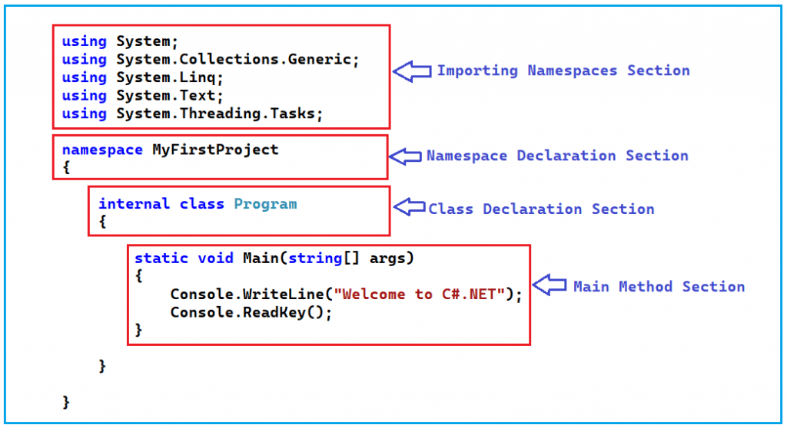

# Basic Structure of C# Program
This repository contains a simple C# program that demonstrates the basic structure of a C# application. The program includes a `Main` method, which serves as the entry point for execution.
## File Structure
- `Program.cs`: Contains the main C# code for the application.
## How to Run
1. Ensure you have the .NET SDK installed on your machine. You can download it from the official [.NET website](https://dotnet.microsoft.com/download).
2. create a new folder for the project and navigate to it in your terminal.
3. Create a new console application using the command:
   ```
   dotnet new console -n BasicCSharpApp
   ```
4. Replace the content of `Program.cs` with the code provided in this repository.
5. Build and run the application using the following commands:
   ```
   dotnet build
   dotnet run
   ```  
 ### understanding the code

- The `using System;` directive allows the program to use classes from the System namespace.
- The `namespace BasicCSharpApp` defines a namespace for the application.
     - Note: A namespace is a container that contains a group of related classes and interfaces, as well as, a namespace can also contain other namespaces.
- The `class Program` defines a class named `Program`.
- The `static void Main(string[] args)` method is the entry point of the application where the program starts executing.it contains the main logic of the application.
- The `Console.WriteLine("Hello, World!");` statement prints "Hello, World!" to the console.

## The Console class in C#
The `Console` class in C# is part of the `System` namespace and provides a simple interface to interact with the console (command line) for input and output operations. It includes methods for reading input from the user and writing output to the console.
### Commonly Used Methods of the Console Class
- `Console.WriteLine()`: Writes a line of text to the console, followed by a newline character.
- `Console.Write()`: Writes text to the console without adding a newline character.
- `Console.ReadLine()`: Reads a line of text input from the console.
- `Console.ReadKey()`: Reads a single key press from the console.
 
 ## data types in C#
 In C#, data types are used to define the type of data that a variable can hold. C# is a statically typed language, which means that the type of a variable must be declared at the time of its creation. C# provides several built-in data types, which can be broadly categorized into value types and reference types.
### Commonly Used Data Types in C#
- `int`: Represents a 32-bit signed integer.
- `float`: Represents a single-precision floating-point number.
- `double`: Represents a double-precision floating-point number.
- `char`: Represents a single 16-bit Unicode character.
- `string`: Represents a sequence of characters (text).
- `bool`: Represents a boolean value (true or false).
- `decimal`: Represents a 128-bit precise decimal value, suitable for financial and monetary calculations.
### Example of Declaring Variables with Different Data Types
```csharp
int age = 25;
float height = 5.9f;
double weight = 70.5;
char grade = 'A';   
string name = "John Doe";
bool isStudent = true;
decimal salary = 50000.75m;
```
### Note
- Value types store data directly, while reference types store a reference to the data's memory address
- C# also supports user-defined data types such as classes, structs, and enums for more complex data structures.

## TypeCasting in C#
Type casting in C# is the process of converting a variable from one data type to another. There are two main types of type casting: implicit and explicit.
### Implicit Casting
Implicit casting is done automatically by the C# compiler when converting a smaller data type to a larger data type. This type of casting is safe and does not result in data loss.
#### Example of Implicit Casting
```csharp
int num = 10;
double doubleNum = num; // Implicitly cast int to double
```
### Explicit Casting
Explicit casting is required when converting a larger data type to a smaller data type. This type of casting can result in data loss, so it must be done manually using a cast operator.
#### Example of Explicit Casting
```csharp
double doubleNum = 9.78;
int num = (int)doubleNum; // Explicitly cast double to int
```
### Note
- Always be cautious when performing explicit casting, as it may lead to loss of data or precision

## control flow statements in C#
Control flow statements in C# are used to control the execution flow of a program based on certain conditions or loops. They allow you to make decisions and repeat actions in your code.
### Common Control Flow Statements in C#
- `if` statement: Used to execute a block of code if a specified condition is true.
- `else` statement: Used to execute a block of code if the condition in the `if` statement is false.
- `else if` statement: Used to specify a new condition to test if the previous `if` condition is false.
- `switch` statement: Used to execute one block of code among multiple options based on the value of a variable.
- `for` loop: Used to repeat a block of code a specific number of times.
- `while` loop: Used to repeat a block of code as long as a specified condition is true.
- `do-while` loop: Similar to the `while` loop, but the block of code is executed at least once before checking the condition.
### Example of Control Flow Statements
```csharp
int number = 10;
if (number > 0)
{
    Console.WriteLine("The number is positive.");
}
else if (number < 0)
{
    Console.WriteLine("The number is negative.");
}
else
{
    Console.WriteLine("The number is zero.");
}

switch (number)
{
    case 1:
        Console.WriteLine("Number is one.");
        break;
    case 10:
        Console.WriteLine("Number is ten.");
        break;
    default:
        Console.WriteLine("Number is neither one nor ten.");
        break;
}

for (int i = 0; i < 5; i++)
{
    Console.WriteLine("Iteration: " + i);
}

int count = 0;
while (count < 5)
{
    Console.WriteLine("Count: " + count);
    count++;
}
```
### Note
- Control flow statements are essential for creating dynamic and responsive applications, allowing you to handle different scenarios and user inputs effectively.
## Functions in C#
Functions in C# are blocks of code that perform a specific task and can be reused throughout the program. They help in organizing code, improving readability, and reducing redundancy. In C#, functions are defined within classes and are also referred to as methods.
### Defining a Function
To define a function in C#, you specify the access modifier, return type, function name, and parameters (if any). The function body contains the code to be executed.
#### Example of Function Definition
```csharp
public int Add(int a, int b)
{
    return a + b;
}
```
### Calling a Function
To call a function, you use its name followed by parentheses, passing any required arguments.
#### Example of Function Call
```csharp
int result = Add(5, 10);
Console.WriteLine("The sum is: " + result);
```
### Function with No Return Value
If a function does not return a value, you can use the `void` return type.
#### Example of Void Function
```csharp
public void PrintMessage(string message)
{
    Console.WriteLine(message);
}
// Calling the void function
PrintMessage("Hello, World!");
```
### Note
- Functions can have parameters to accept input values and can return values using the `return` statement.
- Functions help in breaking down complex problems into smaller, manageable tasks, making the code easier to maintain and understand.

### 🧮 Scenario: Building a Simple Grade Calculator
Imagine you're creating a console application for a teacher to calculate the average grade of students and determine their performance category.

- Data Types: Use int, float, string, and char.
- Typecasting: Convert int to float for precise average calculation.
- Loops: Use a for loop to input multiple grades.
- Functions: Create reusable methods to calculate average and categorize performance.
```csharp
using System;

class GradeCalculator
{
    // Function to calculate average
    static float CalculateAverage(int[] grades)
    {
        int sum = 0;
        for (int i = 0; i < grades.Length; i++)
        {
            sum += grades[i];
        }
        return (float)sum / grades.Length; // Typecasting int to float
    }

    // Function to categorize performance
    static string GetPerformanceCategory(float average)
    {
        if (average >= 80) return "Excellent";
        else if (average >= 60) return "Good";
        else if (average >= 40) return "Average";
        else return "Poor";
    }

    static void Main()
    {
        Console.Write("Enter number of students: ");
        int studentCount = int.Parse(Console.ReadLine());

        for (int s = 1; s <= studentCount; s++)
        {
            Console.WriteLine($"\nStudent {s}:");
            int[] grades = new int[3];

            for (int i = 0; i < grades.Length; i++)
            {
                Console.Write($"Enter grade {i + 1}: ");
                grades[i] = int.Parse(Console.ReadLine());
            }

            float average = CalculateAverage(grades);
            string category = GetPerformanceCategory(average);

            Console.WriteLine($"Average Grade: {average:F2}");
            Console.WriteLine($"Performance: {category}");
        }
    }
}
```
### Explanation of the Code
- The program starts by prompting the user to enter the number of students.
- For each student, it collects three grades using a for loop.
- The `CalculateAverage` function computes the average of the grades, using typecasting to ensure a precise float result.
- The `GetPerformanceCategory` function categorizes the student's performance based on the average grade using if-else statements.
- Finally, the program outputs the average grade and performance category for each student.
## Conclusion
This simple grade calculator demonstrates the use of data types, typecasting, loops, and functions in C#. By organizing the code into functions, we enhance readability and reusability, making it easier to maintain and extend in the future.
Feel free to modify and expand upon this example to further explore C# programming concepts!


   

